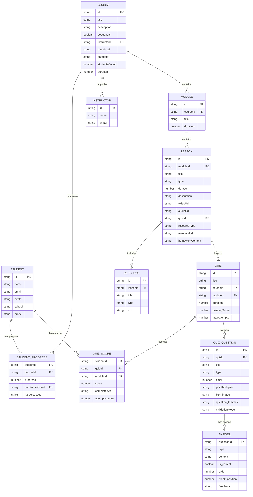

# Database Model & Entity-Relationship Model (MER) 🗃️

This document describes the data entities, attributes, and relationships in the GoEscuela codebase, as modeled in `data/mockData.ts` and offline-persisted via WatermelonDB.

---

## 📊 Entity-Relationship Diagram (MER)

Below is the Entity-Relationship Diagram representing the relational data structures and their associations.

---

## 🗂️ Detailed Entity Documentation

### 1. Student (`Student`)

Represents a user registered in the Learning Management System.

- **`id` (PK)**: Unique identifier of the student.
- **`name`**: Full name of the student.
- **`email`**: Email address.
- **`avatar`**: URL to profile picture.
- **`school`**: School name.
- **`grade`**: School grade (e.g., "10° Grado").
- **`enrolledCourses`**: Array of course IDs (`Course[]`) to track user enrollments (Many-to-Many reference).

---

### 2. Course (`Course`)

A course created by an instructor containing educational modules.

- **`id` (PK)**: Unique identifier.
- **`title`**: Title of the course.
- **`description`**: Core syllabus description.
- **`sequential`**: If true, lessons must be completed strictly in order.
- **`instructor`**: Embedded instructor info:
  - **`id` (FK)**: Instructor identifier.
  - **`name`**: Instructor's name.
  - **`avatar`**: Avatar URL.
- **`thumbnail`**: Visual card image.
- **`category`**: Category name (e.g., "Ciencias", "Idiomas", "Humanidades").
- **`students`**: Number of enrolled students.
- **`duration`**: Approximate total course duration in hours.
- **`modules` (Composition)**: List of modules within the course.

---

### 3. Module (`Module`)

A structural grouping of lessons inside a course.

- **`id` (PK)**: Unique identifier.
- **`title`**: Module title.
- **`lessons` (Composition)**: List of lessons associated with this module.
- **`duration`**: Total duration of lessons within the module in hours.

---

### 4. Lesson (`Lesson`)

Individual learning item.

- **`id` (PK)**: Unique identifier.
- **`title`**: Lesson title.
- **`type`**: Type of lesson (`'video' | 'quiz' | 'resource' | 'homework' | 'audio'`).
- **`duration`**: Duration of the lesson in minutes.
- **`description`**: Summary or body content (optional).
- **`videoUrl`**: URL if lesson type is `'video'` (optional).
- **`audioUrl`**: URL if lesson type is `'audio'` (optional).
- **`quizId` (FK)**: Quiz identifier if lesson type is `'quiz'` (optional).
- **`resourceType`**: Sub-type if lesson type is `'resource'` (`'pdf' | 'audio' | 'link'`).
- **`resourceUrl`**: Target URL for resource content (optional).
- **`homeworkContent`**: Text instructions for the assignment if type is `'homework'` (optional).
- **`resources`**: Sub-resource attachments (e.g. downloads list).

---

### 5. Resource (`Resource`)

A supporting download item attached to a lesson.

- **`id` (PK)**: Unique identifier.
- **`title`**: Name of the resource.
- **`type`**: Attachment format (`'pdf' | 'link' | 'document'`).
- **`url`**: Public link/file path.

---

### 6. Quiz (`Quiz`)

Evaluation module consisting of interactive questions.

- **`id` (PK)**: Unique identifier.
- **`title`**: Title of the evaluation.
- **`courseId` (FK)**: Associated Course.
- **`moduleId` (FK)**: Associated Module.
- **`questions` (Composition)**: Embedded list of questions.
- **`duration`**: Time limit in minutes.
- **`passingScore`**: Target threshold percentage to pass (e.g. 70).
- **`maxAttempts`**: Maximum allowed attempts (null or undefined represents unlimited).

---

### 7. QuizQuestion (`QuizQuestion`)

A question inside a quiz module.

- **`id`**: Unique identifier (optional in mock schemas).
- **`title`**: The question prompt.
- **`type`**: Question formatting (`'multiple-choice' | 'true-false' | 'text' | 'sequence' | 'fill-in-blank'`).
- **`timer`**: Time limit in seconds for this question (optional).
- **`pointMultiplier`**: Multiplier mode (`'none' | 'double'`).
- **`b64_image`**: Optional base64 or source URL image.
- **`question_template`**: Template for fill-in-the-blank questions (e.g., `'El ___ zorro...'`).
- **`validationMode`**: How to validate answers (`'auto' | 'manual' | 'none'`).
- **`answers` (Composition)**: Option choices.

---

### 8. Answer (`Answer`)

A question choice or template response configuration.

- **`type`**: Option type (`'text' | 'image'`).
- **`content`**: Text of the answer option.
- **`is_correct`**: Flag indicating if this is the correct choice/part.
- **`order`**: Ordering index for sequence questions.
- **`blank_position`**: Index position for fill-in-blank slots.
- **`feedback`**: Custom feedback text.
- **`options`**: Selection options for dropdown lists in blank completions.

---

### 9. StudentProgress (`StudentProgress`)

Tracks progress of a specific student in a course.

- **`studentId` (FK)**: Owner student.
- **`courseId` (FK)**: Targeted course.
- **`progress`**: Completion progress percentage (0-100).
- **`completedLessons`**: Array of lesson IDs that are finished.
- **`currentLessonId` (FK)**: The lesson the student is currently on.
- **`lastAccessed`**: Timestamp of last student activity.

---

### 10. QuizScore (`QuizScore`)

Record of a quiz attempt submitted by a student.

- **`quizId` (FK)**: Quiz attempted.
- **`moduleId` (FK)**: Module reference.
- **`score`**: Score obtained (0-100).
- **`completedAt`**: Timestamp of submission.
- **`attemptNumber`**: Sequence index of attempt (e.g. 1st, 2nd attempt).
